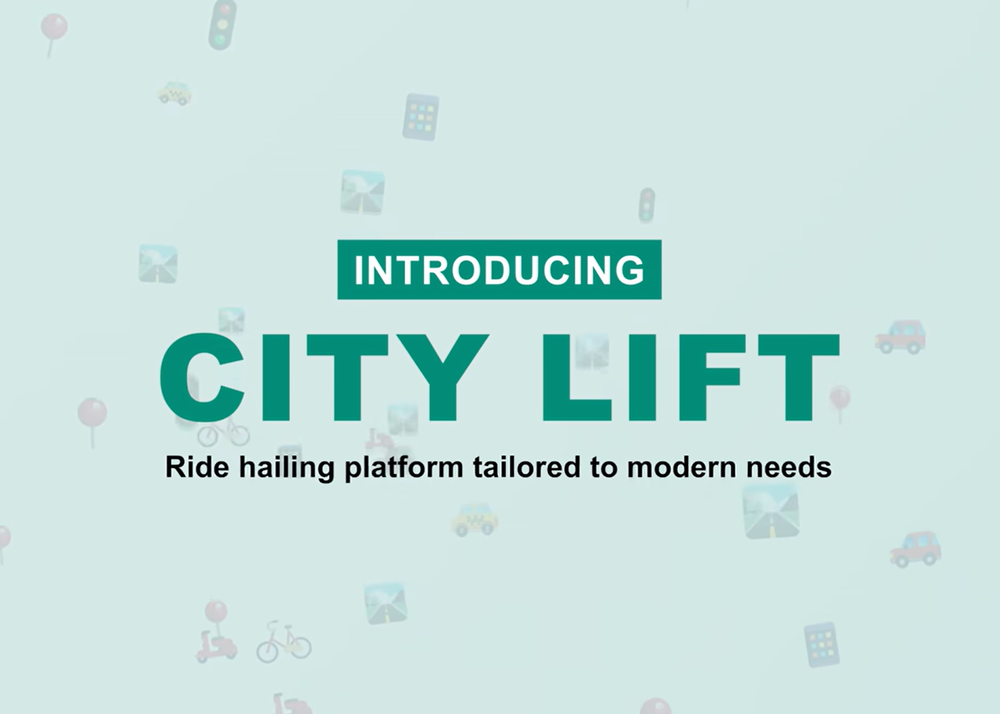
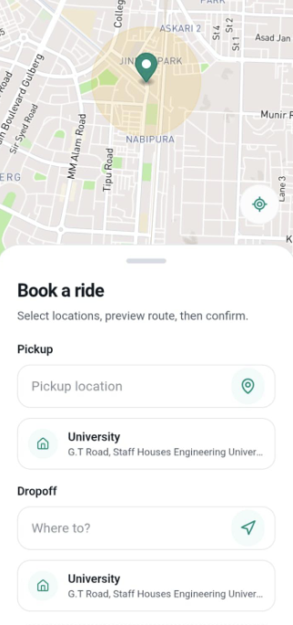
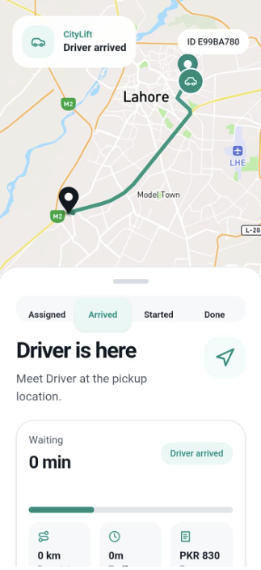

# CityLift Platform Frontend

<div align="center">
  
</div>

A React + Vite frontend for **CityLift**, a ride-hailing platform that provides dedicated experiences for **Riders**, **Drivers**, and **Administrators**. The application supports ride booking, live trip tracking, driver onboarding, vehicle verification, earnings management, and administrative operations through a unified codebase.

The frontend is designed as a mobile-first application and integrates with a separate backend API for authentication, ride management, user accounts, pricing, mapping services, and real-time communication.


>You may also want to check the **[Backend API](https://github.com/AhmadAmin5/CityLift-Ride-Backend)** repository for the server-side implementation.

>[Watch working video](https://www.linkedin.com/posts/ahmadamin5_most-ride-hailing-apps-in-pakistan-solve-ugcPost-7473775508078379008-EEou/)
<table>
  <tr>
    <td align="center">
      
      <br>
      <em>Booking Ride</em>
    </td>
    <td align="center">
      
      <br>
      <em>Ride Started</em>
    </td>
  </tr>
</table>

---

# Overview

This frontend includes:

* Rider application for requesting and managing rides
* Driver application for accepting and completing trips
* Administrative dashboard for platform management
* Authentication and OTP verification
* Interactive maps powered by Mapbox
* Real-time ride updates through Socket.IO
* Mobile deployment support using Capacitor

---

# Tech Stack

* React
* Vite
* React Router
* React Query
* Axios
* Tailwind CSS
* shadcn/ui
* Mapbox GL JS
* Socket.IO Client
* Capacitor (Android)
* Lucide Icons

---

# Getting Started

## Prerequisites

Make sure the following are installed:

* Node.js
* npm
* A running CityLift Backend API
* Mapbox Access Token

---

## 1. Clone the repository

```bash
git clone https://github.com/AhmadAmin5/CityLift-Ride-Frontend.git
cd CityLift-Ride-Frontend
```

---

## 2. Install dependencies

```bash
npm install
```

---

## 3. Configure environment variables

Create a `.env` file in the project root.

```env
VITE_API_BASE_URL=your_backend_api_url
VITE_MAPBOX_ACCESS_TOKEN=your_mapbox_access_token
```

Refer to the project's `.env.sample` file if available.

---

## 4. Start the development server

```bash
npm run dev
```

---

# Available Scripts

```bash
npm run dev             # Start development server
npm run build           # Build production bundle
npm run preview         # Preview production build

npm run cap:sync        # Sync Capacitor project
npm run android:add     # Add Android platform
npm run android:sync    # Sync Android project
npm run android:open    # Open Android Studio
npm run android:run     # Build and run Android app
```

---

# Key Features

## Rider Experience

* Rider registration and authentication
* Ride booking with pickup and destination selection
* Fare estimation before confirming a ride
* Live driver search experience
* Real-time trip tracking
* Ride history
* Saved places management
* Trip receipts
* Driver rating after ride completion

---

## Driver Experience

* Driver onboarding workflow
* Driver document submission
* Vehicle management
* Ride request handling
* Navigation to pickup location
* Active trip management
* Waiting and arrival states
* Trip summaries
* Earnings dashboard
* Driver ratings overview

---

## Administrative Dashboard

* Platform overview dashboard
* Analytics and reporting
* Surge pricing management
* Pricing rule configuration
* Vehicle verification
* Driver document review
* Administrative platform controls

---

## Maps & Location

* Interactive maps powered by Mapbox
* Pickup and destination search
* Route visualization
* Live driver and rider locations
* Geolocation integration through Capacitor

---

## Authentication

* User registration
* Login
* OTP verification
* Persistent authenticated sessions
* Protected application routes

---

## Real-Time Communication

* Live ride status updates
* Driver assignment events
* Trip progress synchronization
* Socket.IO integration for real-time interactions

---

# Project Structure

```text
src/
├── api/                # API service layer
├── assets/             # Images and static assets
├── common/             # Shared loading and error states
├── components/
│   ├── auth/           # Authentication components
│   ├── map/            # Mapbox integration
│   ├── navigation/     # Navigation components
│   ├── ride/           # Ride booking and trip components
│   └── ui/             # Reusable UI components
├── hooks/              # Custom React hooks
├── layouts/            # Application layouts
├── lib/                # Shared utilities
├── pages/
│   ├── admin/
│   ├── auth/
│   ├── driver/
│   ├── rider/
│   └── shared/
├── routes/             # Route configuration
├── services/           # Socket and application services
├── store/              # Global state management
├── utils/              # Helper utilities
├── App.jsx
└── main.jsx
```

---

# Application Modules

## Rider

The rider application provides everything required to request, monitor, and complete trips, including ride estimation, live tracking, ride history, saved destinations, receipts, and driver feedback.

---

## Driver

The driver module supports onboarding, document verification, vehicle management, accepting ride requests, completing trips, earnings tracking, and performance monitoring.

---

## Administration

Administrative pages provide operational tools for managing pricing policies, surge zones, analytics, vehicle verification, and platform monitoring.

---

# Environment Variables

Create a `.env` file in the project root.

```env
VITE_API_BASE_URL=your_backend_api_url
VITE_MAPBOX_ACCESS_TOKEN=your_mapbox_access_token
```

---

# Notes

* This frontend communicates with the CityLift Backend API.
* Interactive maps require a valid Mapbox access token.
* Real-time ride updates are handled through Socket.IO.
* The application is optimized for mobile devices while remaining compatible with desktop browsers.
* Capacitor support enables Android deployment from the same codebase.
* React Query is used for efficient server-state management and API caching.

---

# Why This Project Is Useful

This project provides a complete frontend foundation for a modern ride-hailing platform by combining rider, driver, and administrative workflows into a single application. It demonstrates real-time communication, map integration, mobile deployment with Capacitor, scalable React architecture, and role-based application design, making it a strong starting point for transportation, mobility, and logistics platforms.
